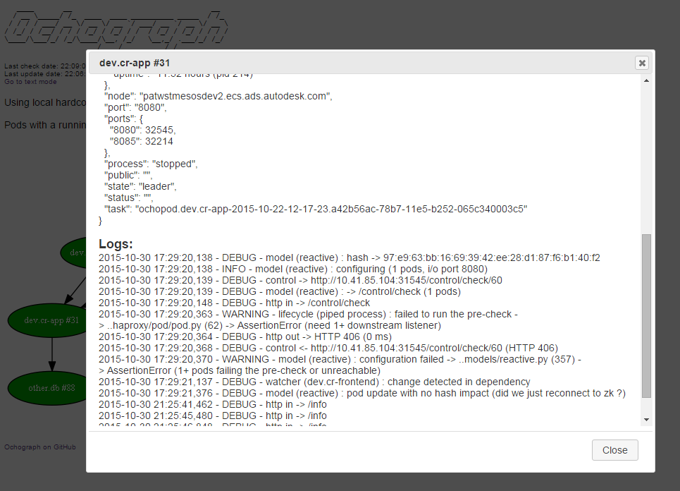

# Ochograph
Ochograph allows to generate dependency graphs of your <a href="https://github.com/autodesk-cloud/ochopod" target="_blank">Ochopod</a> clusters, which is a great way of documenting your environment (<a href="https://en.wikipedia.org/wiki/A_picture_is_worth_a_thousand_words" target="_blank">"a picture is worth a thousands words"</a>).

Features:
- Render dependency graph as text or image (PNG)
- Visualize whether your pods are ON or OFF at first look
- Identify circular dependencies
- Web or standalone mode
- Dynamic reload
- Easily view pods settings and logs (web mode only)

## Usage
You can either access Ochograph with you browser or use it from the command line as a standalone program.

### Web mode
Simply start Ochograph with the -w parameter:
```
python ochograph.py -w
```
There is even a ready-to-use Ochopod/Docker image: deploy it into your Mesos/Marathon and you are good to go. See the Ochothon deployment descriptor file under /images/ochograph/ochothon_ochograph.yml
  
### Standalone mode
Install all the necessary Python libraries and tools (refer to the Dockerfile under /images/ochograph).

Run with:
```
python ochograph.py
```

To generate an image, try:
```
python ochograph.py -i my_image.png
```

Ochograph will try to guess the Zookeeper host(s) by reading the /opt/mesosphere/etc/mesos-slave-common, /opt/mesosphere/etc/mesos-slave and /etc/mesos/zk files. You can force a given Zookeeper host with the -z paramater, e.g.:
```
python ochograph.py -z 127.0.0.1:2181
```

## Examples

### Web mode



### Standalone mode


## Release notes

### 0.2.2 (3/24/2016)
- Allow to specify an optional base path for accessing Ochograph: this is convenient when you have a reverse proxy in front of Ochograph that exposes it through a subpath, e.g. http://myserver/ochograph (see the deployment descriptor file under /images/ochograph/ochothon_ochograph.yml for details)
- Ochograph logs now visible in the Ochopod logs (i.e. pipe subprocess)

### 0.2.1 (11/5/2015)
- Try to guess Zookeeper host(s) by reading /opt/mesosphere/etc/mesos-slave-common and /opt/mesosphere/etc/mesos-slave (on top of /etc/mesos/zk)

### 0.2 (11/3/2015)
- Get pods details (info and logs) in web mode by clicking the desired pod
- Dynamic reload in web mode (no page reload): the graph is automatically updated when changes occur in the pods configuration (e.g. when pods are deployed, removed, sub-processed are started/stopped)
- Multithreaded HTTP server 

### 0.1 (10/30/2015)
- First version with web and standalone modes
- Generate graphs as text or image (PNG)
- Show whether Ochopod sub-process is running or not