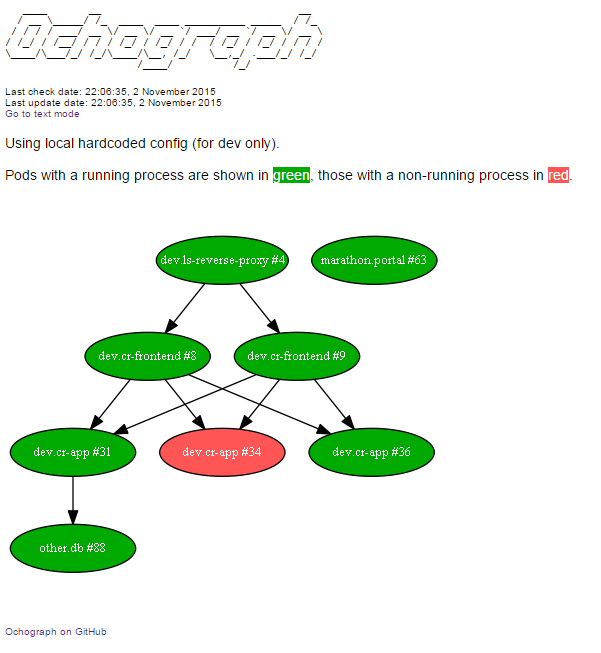
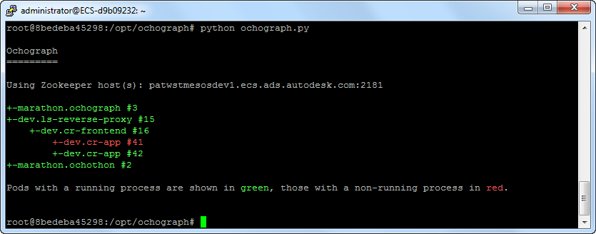

# Ochograph
Ochograph allows to generate dependency graphs of your <a href="https://github.com/autodesk-cloud/ochopod" target="_blank">Ochopod</a> clusters, which is a great way of documenting your environment (<a href="https://en.wikipedia.org/wiki/A_picture_is_worth_a_thousand_words" target="_blank">"a picture is worth a thousands words"</a>).

Features:
- Render dependency graph as text or image (PNG)
- Visualize whether your pods are ON or OFF at first look
- Identify circular dependencies
- Web access or standalone mode

## Pre-requesites
Note that this pre-requesite will not be necessary anymore once/of <a href="https://github.com/autodesk-cloud/ochopod/pull/37" target="_blank">this pull request</a> is accepted.

For now, every single pod must list its dependencies as a list of "&lt;cluster_name&gt;:&lt;port&gt;" under the 'dependsOn' key of the JSON returned by the sanity_check method, e.g.:

```
def sanity_check(self, pid):
	# Will result in something like "mysql:3306"
	depends_on = cfg['db_cluster_name'] + ":" + cfg['db_cluster_port']

	# Result would then be {'dependsOn': ["mysql:3306"]}
	return {'dependsOn': [depends_on]}
```

## Usage
You can either access Ochograph with you browser or use it from the command line as a standalone program.

### Web access
Simply start Ochograph with the -h parameter:
```
python ochograph.py -h
```
There is even a ready-to-use Ochopod/Docker image: deploy it into your Mesos/Marathon and you are good to go. See the Ochothon deployment descriptor file under /images/ochograph/ochothon_ochograph.yml
  

### Standalone mode
Install all the necessary Python libraries and tools (refer to the Dockerfile under /images/ochograph).

Run with:
```
python ochograph.py
```

To generate an image, try:
```
python ochograph.py -i my_image.png
```

Ochograph will try to guess the Zookeeper host(s) by reading the /etc/mesos/zk file. You can force a given Zookeeper host with the -z paramater, e.g.:
```
python ochograph.py -z 127.0.0.1:2181
```

## Examples

# Web access


# Standalone mode
